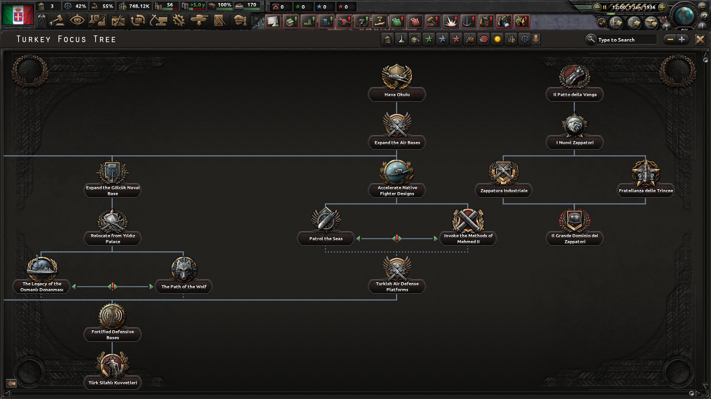
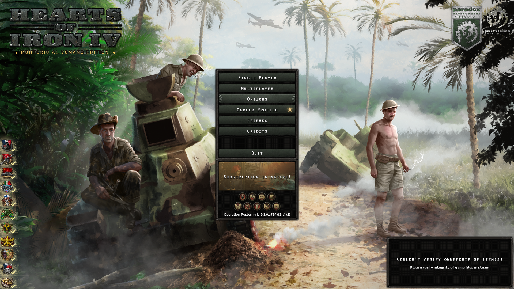

# 🎖️ Montorio HOI4 MOD

> *Riscrivi la storia e guida i Montoriesi alla conquista del mondo su Hearts of Iron IV!*

---

**✨ Caratteristiche Principali**

* 🌳 **Albero dei Focus personalizzato:** Scegli l'ideologia dei Nuovi Zappatori e definisci il suo destino.
* 🎖️ **Leader Custom:** Ritratti personalizzati per tutti i leader politici e i comandanti dell'esercito.
* 📋 **Nuovo Menu Principale:** custom made per Hearts Of Iron IV.

---

## 📅 Roadmap - Future Implementazioni

| Versione | Novità in arrivo | Stato |
| :---: | :---: | :---: |
| **v0.0.5** | • Bugfix | ✅ Completato |
| **v0.0.6** | • Nuovi eventi storici e scenari alternativi • Aggiunta di unità speciali "Zappatori d'Assalto" • Supporto per la lingua inglese | 🔄 In sviluppo |

---

**🖼️ Anteprima**

| Albero dei Focus | Menù Principale |
| :---: | :---: |
|  |  |
| Nuovi Leaders |

---

**🐛 Segnalazione Bug e Richieste**

Hai riscontrato un problema o vuoi proporre nuove idee per la mod?
* **Segnala un Bug:** Apri una segnalazione nella sezione [Issues](../../issues/new?template=bug_report.md) spiegando cosa è successo.

---

**⚙️ Guida all'Installazione**

1. Scarica l'ultima versione dalla pagina delle [Releases](../../releases).
2. Estrai il contenuto nella cartella mod di Hearts of Iron IV:
   * **Windows:** `C:\Utenti\<NomeUtente>\Documenti\Paradox Interactive\Hearts of Iron IV\mod\`
   * **Linux:** `~/.local/share/Paradox Interactive/Hearts of Iron IV/mod/`
   * **macOS:** `~/Documents/Paradox Interactive/Hearts of Iron IV/mod/`
3. Assicurati che siano presenti sia la cartella del mod che il file `.mod` corrispondente.
4. Apri il **Paradox Launcher**, aggiungi la mod al tuo **Playset** ed abilitala prima di avviare il gioco.

---

**📜 Crediti**

* Creato da **[Salvatore Grasso / SalvatoreIII + Lorenzo Capezzali / Bubolo_Uomo]**
